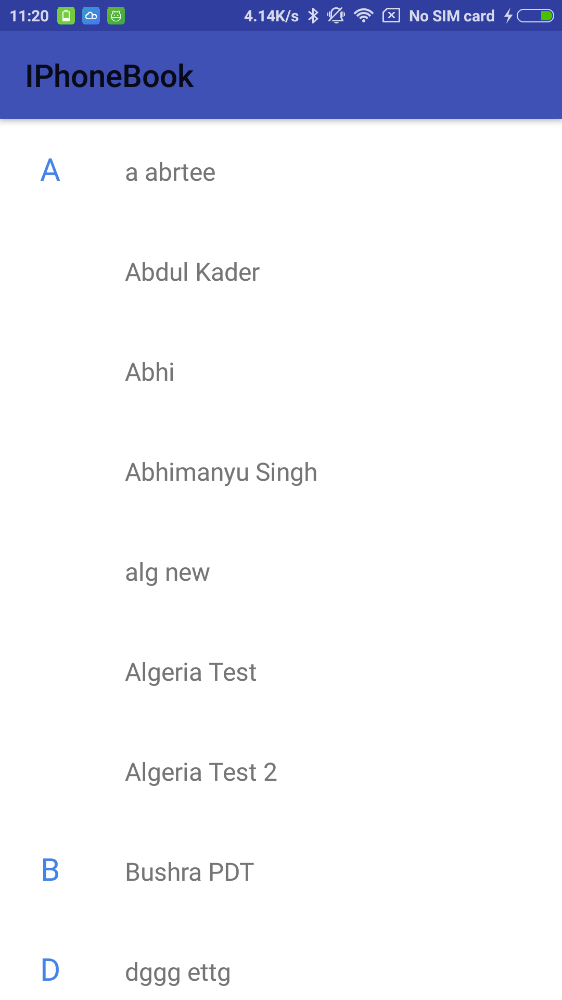

# StickyHeaderPhoneBookLikeLolipopAndroid
This is a simple phone book with sticky header. Like this: 

  
Here I have included a Fragment that loades the contacts view LoaderManager and shows them in RecyclerView.  
You can just open the fragment in your container to get the phone book in your app.  
This project does not handles other options like call on click, or click effect. I tried to keep it pretty simple so that one can understands how the sticky header works. You can use it and implement the functionality you need on top of this.   
Thank you

